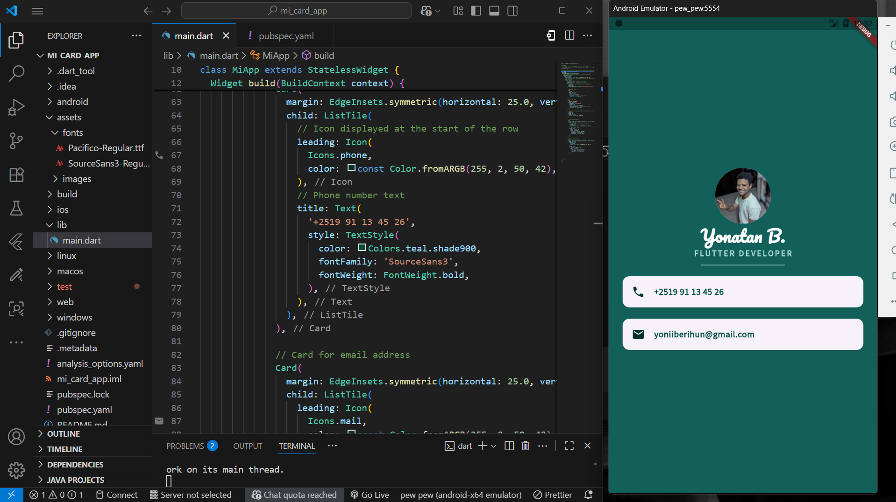

# MI Card App

A simple Flutter app that displays a personal profile card. This project is designed for beginners to practice building clean UIs using basic Flutter widgets and layouts. It's a great starting point for experimenting with widget composition, custom fonts, and color themes.

## Screenshot of the project

  

## Features

- Displays a centered personal profile card with a profile image, name, role, and contact details (phone and email).
- Uses a clean, minimalistic layout with consistent spacing and dividers for better readability.
- Applies a custom color theme for a professional look.
- Incorporates external custom fonts to enhance typography.
- Responsive design that works on both mobile devices and emulators.

## Widgets Used

This app focuses on composing a UI with fundamental Flutter widgets. Here's a list of the key ones practiced in this project:

- **Column**: For vertically stacking elements like the profile image, name, role, and contact info.
- **SafeArea**: To ensure the content avoids notches and system UI elements on devices.
- **CircleAvatar**: To display a circular profile image.
- **Text**: For rendering the name, role, phone, and email with custom styling.
- **SizedBox**: To add consistent spacing between widgets.
- **Divider**: To separate sections visually, like between the profile info and contacts.
- **Card**: To create a card-like container for contact details.
- **ListTile**: For displaying contact items (phone and email) in a structured, tappable format.

These widgets are combined to build a simple yet effective layout, helping you understand how they work together.

## Getting Started

To run this project locally on your machine, follow these beginner-friendly steps:

1. **Prerequisites**:
   - Install Flutter: Download and set up Flutter from the official site (https://flutter.dev). Make sure you have Dart installed as well (it comes with Flutter).
   - Have an IDE like VS Code or Android Studio with Flutter plugins enabled.
   - An Android/iOS emulator or a physical device for testing.

2. **Clone the Repository**:
   ```
   git clone https://github.com/Yoni-Berihun/mi-card-app.git
   cd mi-card-app
   ```

3. **Install Dependencies**:
   Run this command in the project directory to fetch the required packages:
   ```
   flutter pub get
   ```

4. **Run the App**:
   Start an emulator or connect your device, then run:
   ```
   flutter run
   ```
   The app should build and launch, showing the profile card.

If you encounter any issues, check the Flutter documentation or run `flutter doctor` to diagnose setup problems.

## Adding Custom Fonts in Flutter

Custom fonts can make your app stand out. Here's a simple guide to add them, as done in this project:

1. **Download Fonts**:
   Find free fonts (e.g., from Google Fonts) and download the .ttf or .otf files.

2. **Add Fonts to Your Project**:
   Create a `fonts` folder in your project's root directory. Place your font files there (e.g., `fonts/Pacifico-Regular.ttf`).

3. **Update pubspec.yaml**:
   In your `pubspec.yaml` file, add the fonts under the `flutter` section:
   ```
   flutter:
     fonts:
       - family: Pacifico
         fonts:
           - asset: fonts/Pacifico-Regular.ttf
   ```
   (Replace `Pacifico` with your font family name.)

4. **Use the Font in Your Code**:
   Apply it to a `Text` widget like this:
   ```dart
   Text(
     'Your Name',
     style: TextStyle(
       fontFamily: 'Pacifico',
       fontSize: 40.0,
       color: Colors.white,
     ),
   )
   ```

5. **Run `flutter pub get`**:
   This updates your project with the new assets.

Remember to hot-reload (press 'r' in the terminal) to see changes without restarting the app.

## Conclusion

This MI Card App serves as an excellent hands-on project for Flutter beginners, demonstrating how to build a simple yet polished UI using core widgets. By working through this, you'll gain confidence in layout composition, theming, and asset integration. Feel free to extend it with more features, like adding interactivity or additional profile details, to further your learning journey. Happy coding!

## License

This project is licensed under the MIT License. See the [LICENSE](LICENSE) file for details. Feel free to use, modify, and learn from it!

Made with ❤️ by @yoni-berihun
